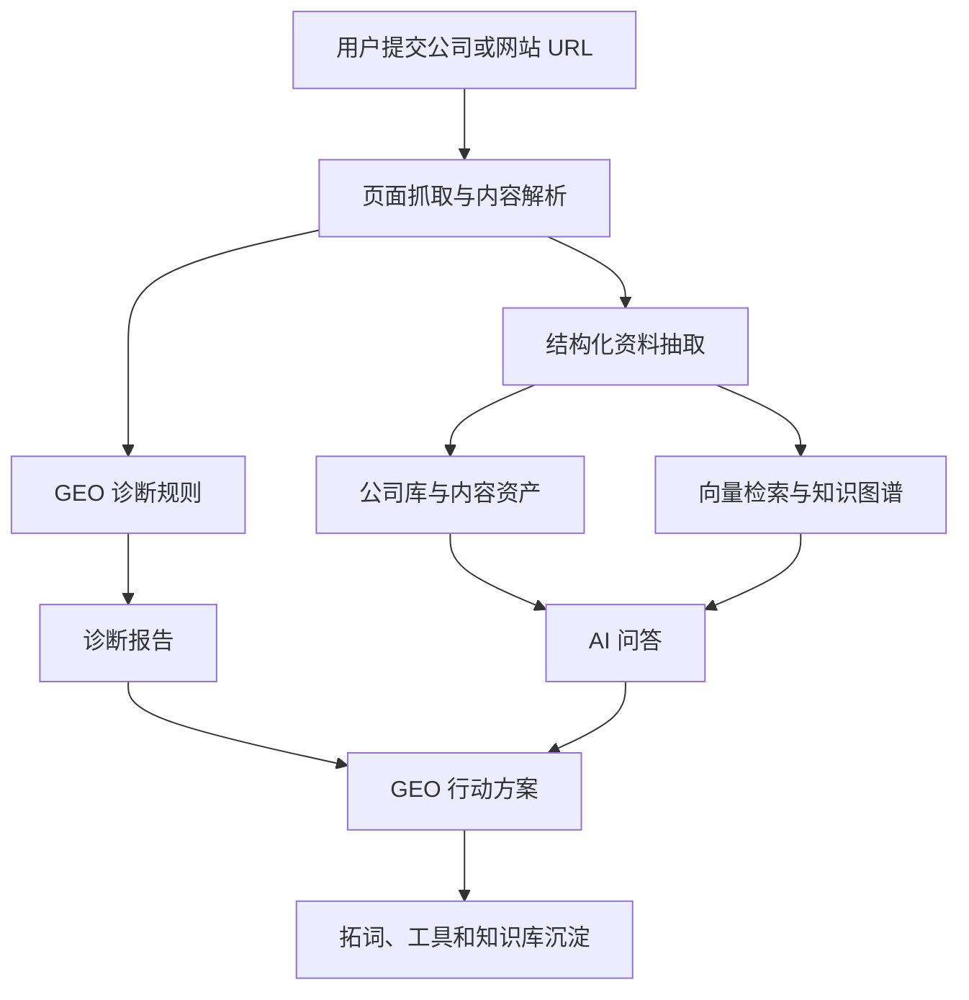

# GEO工作台

GEO工作台是一个面向 GEO（生成式引擎优化）的工作台，用于诊断网站和品牌在 AI 搜索中的可见性，并把诊断结果转化为问答、方案、拓词、结构化工具和可管理的内容资产。

先诊断，再提问，再生成方案，再沉淀关键词、结构化数据和知识库。

## 核心功能

| 模块 | 说明 |
|---|---|
| 公司目录 | 收录和管理 GEO 相关公司、工具、服务商与案例，支持提交、审核、发布和分类 |
| 网站诊断 | 检查 Schema、页面结构、Meta 信息、内容可读性、引用信号和 AI 搜索可见性 |
| AI 问答 | 围绕 GEO、AI 搜索和品牌可见性生成结构化回答，并结合公司与诊断上下文 |
| GEO 方案 | 根据目标、网站、资源和限制条件，生成可执行的 30/60/90 天优化计划 |
| 拓词工作台 | 从业务词扩展问题词、场景词、商业意图词和推荐型关键词资产 |
| GEO 工具 | JSON-LD 生成器、llms.txt 生成器、AI 友好度评分、GEO 标题生成器和知识库生成器 |
| 专家频道 | 展示 GEO 与 AI 相关专家的公开资料、实践方向和详情介绍 |
| 教程频道 | 沉淀 GEO 基础知识、评估治理、内容结构、技术标记和实战案例 |
| 管理后台 | 管理公司、诊断、问答、拓词、专家、教程、用户、系统设置、API 池、模块开关和自定义首页 |

## 技术架构

monorepo 架构，包含静态前台、Next.js 迁移代码、FastAPI 后端和共享包。

- **前台**：3009 静态前台（`dist/`）作为主要体验版本，同时保留 Next.js App Router 迁移方向（`apps/web`）。
- **后台**：Next.js 管理台（`apps/admin`）。
- **后端**：FastAPI、SQLAlchemy、Alembic、Celery。
- **数据服务**：PostgreSQL、Redis、Qdrant、Neo4j、MinIO。
- **AI 层**：兼容 OpenAI 格式的 Chat 与 Embedding Provider，支持后台配置 API 池。
- **工程化**：pnpm workspace、Turborepo、OpenAPI SDK、Docker Compose。



## 目录结构

```text
GEO工作台/
  apps/
    web/          # Next.js 前台
    admin/        # Next.js 管理台
  packages/
    api-sdk/      # OpenAPI 生成的 TypeScript SDK
    auth/         # 会话与页面守卫
    i18n/         # 多语言路由与字典
    ui/           # 前后台共享 UI
  backend/        # FastAPI / Celery / SQLAlchemy
  cli/            # 命令行工具
  dist/           # 当前 3009 静态前台与后台页面
  infra/          # Nginx 等基础设施配置
  docs/           # 项目文档
```

## 本地运行

> 首次运行前，请先复制环境变量模板，并填入自己的密钥。

```bash
pnpm install
cp .env.example .env
docker compose -f docker-compose.yml -f docker-compose.dev.yml up -d

# 前台应用
pnpm dev:web

# 管理后台
pnpm dev:admin
```

Compose 会先运行一次性 `migrate` 服务。数据库到达 Alembic head 后，API 与异步任务服务才会启动；`docker compose ps` 中 `migrate` 显示 `Exited (0)` 属于正常状态。升级、旧数据库恢复与故障处理见 [数据库迁移与启动](docs/database-migrations.md)。

涉及 AI 的功能需要配置兼容 OpenAI 格式的模型 API。可以在 `.env` 中配置，也可以在后端运行后进入后台系统设置里配置 API 池。

## API 与模型配置

支持兼容 OpenAI 格式的模型服务。后台系统设置中可以配置多个 Provider，并支持：

- API Key 加密保存。
- Base URL 和模型名称配置。
- Provider 连通性测试。
- API 轮询与故障转移策略。
- 额度控制和用户自定义 Key。

本仓库不包含任何真实 API Key，需要使用自己的模型服务，并自行承担成本、隐私和合规责任。

## 免责声明

GEO工作台用于帮助团队分析和改善 AI 搜索可见性。它不出售排名，不保证任何模型一定推荐某个品牌，也不代表任何 AI 搜索平台。

## License

软件代码采用 Apache-2.0。专家资料、姓名、肖像、品牌与内置首页内容适用额外的权利边界，详见 [DATA_LICENSE.md](DATA_LICENSE.md)。
